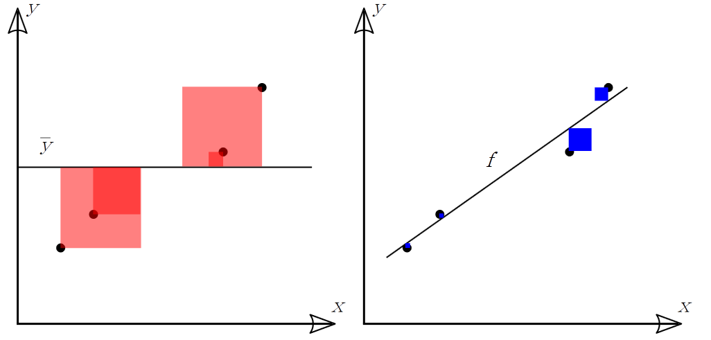
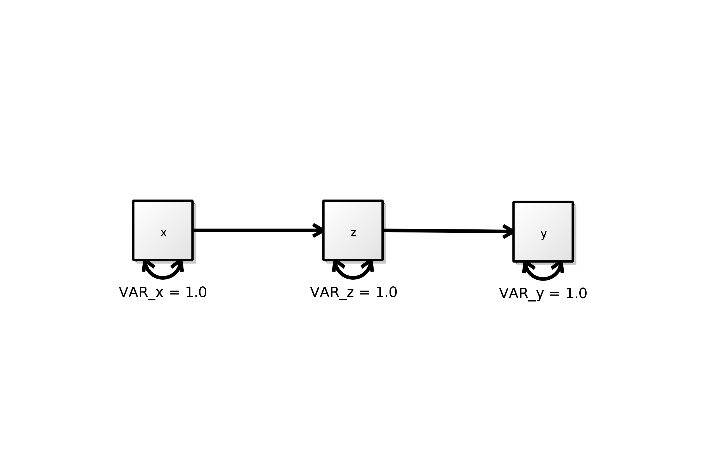

Introduction to Factor Analysis
========================================================

```{r data ,echo=FALSE,comment=NA,message=FALSE}
library(xtable)
```

## Ordinary Least Squares Estimation



## $$R^2 = 1 - \frac{RSS} {TSS}$$

## Maximum LIkelihood Estimation

```{r , results='asis'}
# sample covariance matrix
S <- matrix(c(4.0, 2.4, 2.8,       #
              2.4, 4.0, 2.0,
              2.8, 2.0, 4.0), nrow=3)

# predicted covariance matrix
SIGM <- matrix(c(4.0, 2.4, 1.2,    #
                 2.4, 4.0, 2.0,
                 1.2, 2.0, 4.0), nrow=3)

RES <- S - SIGM             # RESIDUAL COVARIANCE MATRIX
SDET  <- det(S)             # DETERMINANT OF THE SAMPLE COVARIANCE MATRIX
SIGMDET  <- det(SIGM)       # DETERMINANT OF THE PREDICTED COVARIANCE MATRIX
LOGS  <- log(SDET)          # NATURAL LOG OF SAMPLE MATRIX DETERMINANT
LOGSIGM  <- log(SIGMDET)    # NATURAL LOG OF PREDICTED MATRIX DETERMINANT
SIGMINV = solve(SIGM)       # INVERSE OF PREDICTED MATRIX
SDIV = S %*% SIGMINV        # MULTIPLICATION OF SAMPLE MATRIX AND PREDICTED INVERSE
STRACE = sum(diag(SDIV))    # TRACE OF THE RESULTING SDIV MATRIX
SORDER = dim(S)[1]          # ORDER OF SAMPLE MATRIX = NUMBER OF INDICATORS

#  calculation of Fml
FML = abs((LOGS - LOGSIGM) + STRACE - SORDER);

print(xtable(S),type="html")
```




```{r}
library(lavaan);
S <- matrix(c(4.0, 2.4, 2.8,       #
              2.4, 4.0, 2.0,
              2.8, 2.0, 4.0), nrow=3,
            dimnames=list(rownames=c("x","z","y"),colnames=c("x","z","y")))


 onyx.model<-"
! regressions 
   z ~ a*x
   y ~ b*z
! residuals, variances and covariances
   x ~~ x
   z ~~ z
   y ~~ y
! IDE
ab := a*b 

"
fit<-lavaan(onyx.model,sample.cov=S,sample.nobs=200,fixed.x=FALSE,mimic="EQS")
summary(fit, fit.measures=TRUE)


#str(fit,give.attr=FALSE)
#fit@ParTable
#parametertable(fit)
#fit@Fit@Sigma.hat
#fit@SampleStats@cov@num
```


## Table 2.1
### (nothing lavaan here)
### Author: this section by William Murrah

```{r, comment=NA}

library(psych)
S <- matrix(c(1.00, 0.70, 0.65, 0.62,     # Sample correlation matrix
              0.70, 1.00, 0.66, 0.63,     #
              0.65, 0.66, 1.00, 0.60,     #
              0.62, 0.63, 0.60, 1.00), nrow=4)
N <- 300
fit <- factanal(covmat=S,factors=1,n.obs=300)
fit
fit.fa <- fa(r=S,nfactors=1,n.obs=300)
summary(fit.fa)
fit.fa
```


```{r mplusmissing}

```

[id]: images/ex1.png "Title"
