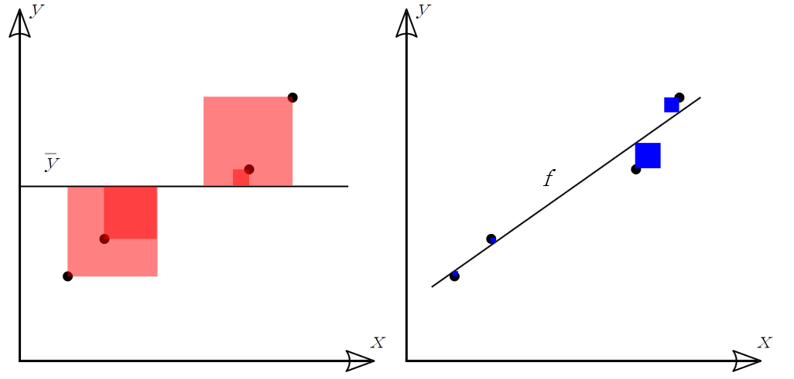
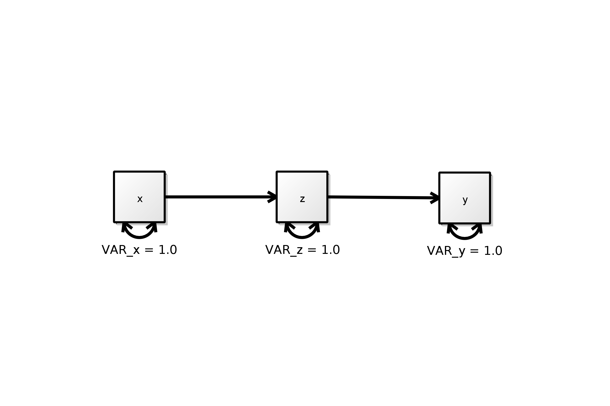

Introduction to Factor Analysis
========================================================


## Ordinary Least Squares Estimation



## $$R^2 = 1 - \frac{RSS} {TSS}$$

## Maximum LIkelihood Estimation


```r
# sample covariance matrix
S <- matrix(c(4.0, 2.4, 2.8,       #
              2.4, 4.0, 2.0,
              2.8, 2.0, 4.0), nrow=3)

# predicted covariance matrix
SIGM <- matrix(c(4.0, 2.4, 1.2,    #
                 2.4, 4.0, 2.0,
                 1.2, 2.0, 4.0), nrow=3)

RES <- S - SIGM             # RESIDUAL COVARIANCE MATRIX
SDET  <- det(S)             # DETERMINANT OF THE SAMPLE COVARIANCE MATRIX
SIGMDET  <- det(SIGM)       # DETERMINANT OF THE PREDICTED COVARIANCE MATRIX
LOGS  <- log(SDET)          # NATURAL LOG OF SAMPLE MATRIX DETERMINANT
LOGSIGM  <- log(SIGMDET)    # NATURAL LOG OF PREDICTED MATRIX DETERMINANT
SIGMINV = solve(SIGM)       # INVERSE OF PREDICTED MATRIX
SDIV = S %*% SIGMINV        # MULTIPLICATION OF SAMPLE MATRIX AND PREDICTED INVERSE
STRACE = sum(diag(SDIV))    # TRACE OF THE RESULTING SDIV MATRIX
SORDER = dim(S)[1]          # ORDER OF SAMPLE MATRIX = NUMBER OF INDICATORS

#  calculation of Fml
FML = abs((LOGS - LOGSIGM) + STRACE - SORDER);

print(xtable(S),type="html")
```

<!-- html table generated in R 3.0.1 by xtable 1.7-1 package -->
<!-- Wed Aug 14 22:48:50 2013 -->
<TABLE border=1>
<TR> <TH>  </TH> <TH> 1 </TH> <TH> 2 </TH> <TH> 3 </TH>  </TR>
  <TR> <TD align="right"> 1 </TD> <TD align="right"> 4.00 </TD> <TD align="right"> 2.40 </TD> <TD align="right"> 2.80 </TD> </TR>
  <TR> <TD align="right"> 2 </TD> <TD align="right"> 2.40 </TD> <TD align="right"> 4.00 </TD> <TD align="right"> 2.00 </TD> </TR>
  <TR> <TD align="right"> 3 </TD> <TD align="right"> 2.80 </TD> <TD align="right"> 2.00 </TD> <TD align="right"> 4.00 </TD> </TR>
   </TABLE>





```r
library(lavaan);
```

```
## Loading required package: MASS Loading required package: boot Loading
## required package: mnormt Loading required package: pbivnorm Loading
## required package: quadprog This is lavaan 0.5-14 lavaan is BETA software!
## Please report any bugs.
```

```r
S <- matrix(c(4.0, 2.4, 2.8,       #
              2.4, 4.0, 2.0,
              2.8, 2.0, 4.0), nrow=3,
            dimnames=list(rownames=c("x","z","y"),colnames=c("x","z","y")))


 onyx.model<-"
! regressions 
   z ~ a*x
   y ~ b*z
! residuals, variances and covariances
   x ~~ x
   z ~~ z
   y ~~ y
! IDE
ab := a*b 

"
fit<-lavaan(onyx.model,sample.cov=S,sample.nobs=200,fixed.x=FALSE,mimic="EQS")
summary(fit, fit.measures=TRUE)
```

```
## lavaan (0.5-14) converged normally after  15 iterations
## 
##   Number of observations                           200
## 
##   Estimator                                         ML
##   Minimum Function Test Statistic               80.688
##   Degrees of freedom                                 1
##   P-value (Chi-square)                           0.000
## 
## Model test baseline model:
## 
##   Minimum Function Test Statistic              226.747
##   Degrees of freedom                                 3
##   P-value                                        0.000
## 
## Full model versus baseline model:
## 
##   Comparative Fit Index (CFI)                    0.644
##   Tucker-Lewis Index (TLI)                      -0.068
## 
## Loglikelihood and Information Criteria:
## 
##   Loglikelihood user model (H0)              -1193.855
##   Loglikelihood unrestricted model (H1)      -1153.308
## 
##   Number of free parameters                          5
##   Akaike (AIC)                                2397.709
##   Bayesian (BIC)                              2414.201
##   Sample-size adjusted Bayesian (BIC)         2398.360
## 
## Root Mean Square Error of Approximation:
## 
##   RMSEA                                          0.631
##   90 Percent Confidence Interval          0.519  0.751
##   P-value RMSEA <= 0.05                          0.000
## 
## Standardized Root Mean Square Residual:
## 
##   SRMR                                           0.163
## 
## Parameter estimates:
## 
##   Information                                 Expected
##   Standard Errors                             Standard
## 
##                    Estimate  Std.err  Z-value  P(>|z|)
## Regressions:
##   z ~
##     x         (a)     0.600    0.057   10.580    0.000
##   y ~
##     z         (b)     0.500    0.061    8.145    0.000
## 
## Variances:
##     x                 4.000    0.401    9.975    0.000
##     z                 2.560    0.257    9.975    0.000
##     y                 3.000    0.301    9.975    0.000
## 
## Defined parameters:
##     ab                0.300    0.046    6.454    0.000
```

```r


#str(fit,give.attr=FALSE)
#fit@ParTable
#parametertable(fit)
#fit@Fit@Sigma.hat
#fit@SampleStats@cov@num
```


## Table 2.1
### (nothing lavaan here)
### Author: this section by William Murrah


```r

library(psych)
```

```
Attaching package: 'psych'

The following object is masked from 'package:boot':

logit
```

```r
S <- matrix(c(1.00, 0.70, 0.65, 0.62,     # Sample correlation matrix
              0.70, 1.00, 0.66, 0.63,     #
              0.65, 0.66, 1.00, 0.60,     #
              0.62, 0.63, 0.60, 1.00), nrow=4)
N <- 300
fit <- factanal(covmat=S,factors=1,n.obs=300)
fit
```

```

Call:
factanal(factors = 1, covmat = S, n.obs = 300)

Uniquenesses:
[1] 0.314 0.293 0.380 0.434

Loadings:
     Factor1
[1,] 0.828  
[2,] 0.841  
[3,] 0.788  
[4,] 0.752  

               Factor1
SS loadings      2.579
Proportion Var   0.645

Test of the hypothesis that 1 factor is sufficient.
The chi square statistic is 0.2 on 2 degrees of freedom.
The p-value is 0.903 
```

```r
fit.fa <- fa(r=S,nfactors=1,n.obs=300)
summary(fit.fa)
```

```

Factor analysis with Call: fa(r = S, nfactors = 1, n.obs = 300)

Test of the hypothesis that 1 factor is sufficient.
The degrees of freedom for the model is 2  and the objective function was  0 
The number of observations was  300  with Chi Square =  0.2  with prob <  0.9 

The root mean square of the residuals (RMSA) is  0 
The df corrected root mean square of the residuals is  0.01 

Tucker Lewis Index of factoring reliability =  1.009
RMSEA index =  0  and the 90 % confidence intervals are  NA 0.048
BIC =  -11.2
```

```r
fit.fa
```

```
Factor Analysis using method =  minres
Call: fa(r = S, nfactors = 1, n.obs = 300)
Standardized loadings (pattern matrix) based upon correlation matrix
   MR1   h2   u2
1 0.83 0.69 0.31
2 0.84 0.71 0.29
3 0.79 0.62 0.38
4 0.75 0.57 0.43

                MR1
SS loadings    2.58
Proportion Var 0.64

Test of the hypothesis that 1 factor is sufficient.

The degrees of freedom for the null model are  6  and the objective function was  2.05 with Chi Square of  607.2
The degrees of freedom for the model are 2  and the objective function was  0 

The root mean square of the residuals (RMSR) is  0 
The df corrected root mean square of the residuals is  0.01 

The harmonic number of observations is  300 with the empirical chi square  0.06  with prob <  0.97 
The total number of observations was  300  with MLE Chi Square =  0.2  with prob <  0.9 

Tucker Lewis Index of factoring reliability =  1.009
RMSEA index =  0  and the 90 % confidence intervals are  NA 0.048
BIC =  -11.2
Fit based upon off diagonal values = 1
Measures of factor score adequacy             
                                                MR1
Correlation of scores with factors             0.94
Multiple R square of scores with factors       0.88
Minimum correlation of possible factor scores  0.77
```


[id]: images/ex1.png "Title"
